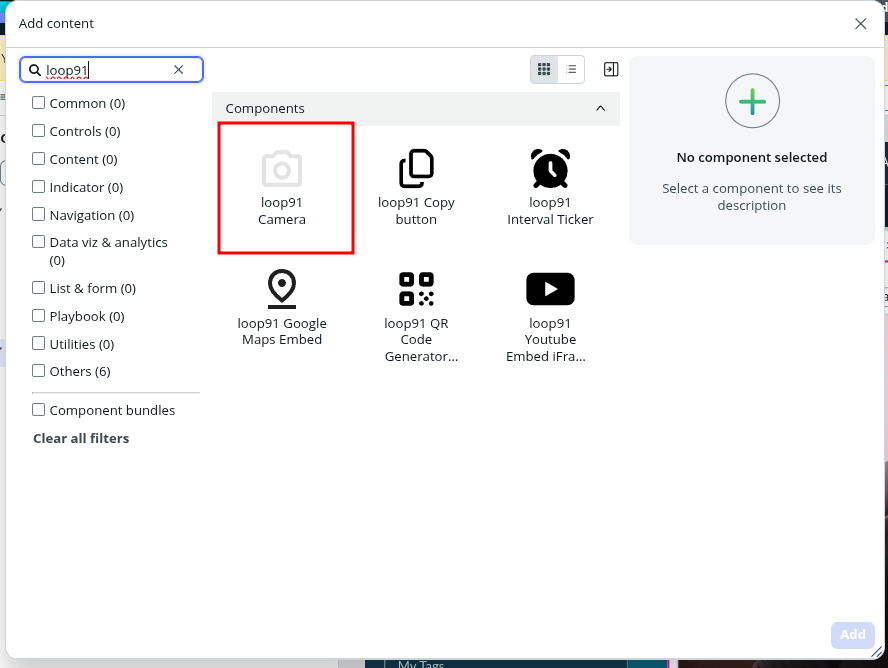
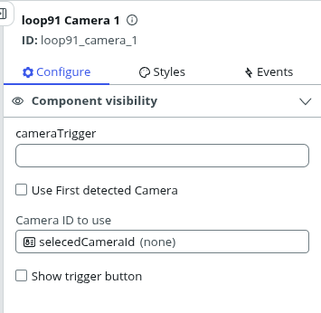
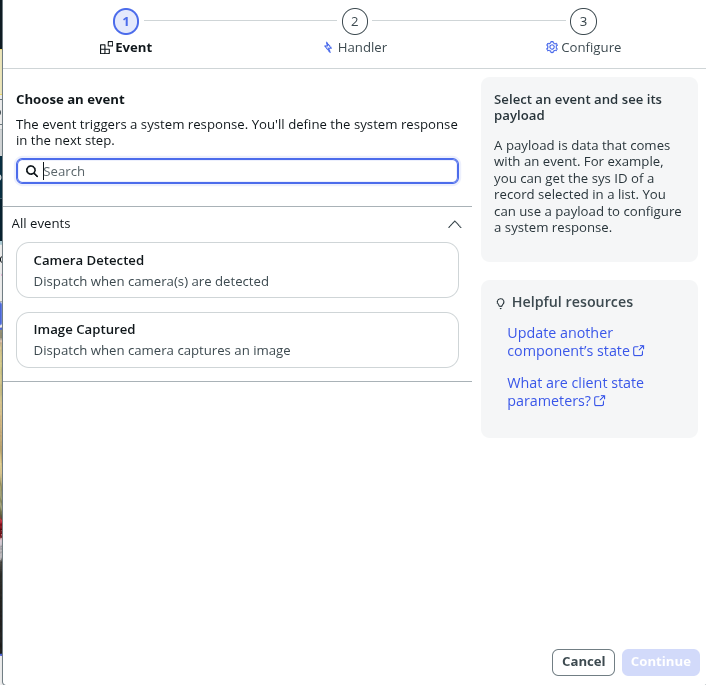

## How to use this component
1. Open UI Builder 
2. Click `Add Content` to open the component picker

    

    -
3. Configure your component

    
    - cameraTrigger : Change this string property to any value to trigger camera click. Since ServiceNow doesn't allow methods on UI Components, we track this property. Any time this value is changed( it could be any string or number, i.e. use Math.random()), it will trigger camera click
    - Use First detected camera : important for system with multiple cameras, e.g. Mobile phone,etc. If selected, first camera available is auto enabled
    - Camera ID to use : for systems with multiple camera, this property allows you to switch between different cameras
    - Show trigger button, when enabled, the camera canvas will show a 50x50px red camera button that can be used to trigger camera click
4. Events 
    
    - Camera Detected : when component is mounted, it will trigger user consent to use camera(s). Once user allows, browser shares list of available devices with component. This list is shared by this event. Use this to populate a Select,etc which allows user to switch between cameras
    - Image Captured : Post camera click is triggered, this event return [dataURL](https://developer.mozilla.org/en-US/docs/Web/URI/Reference/Schemes/data) of image captured. 