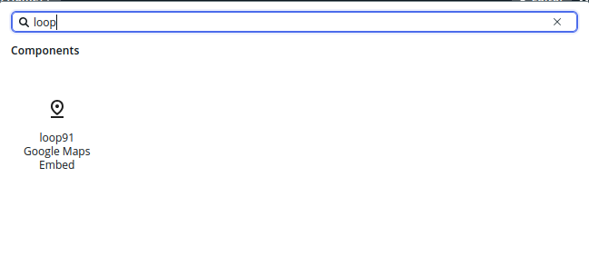
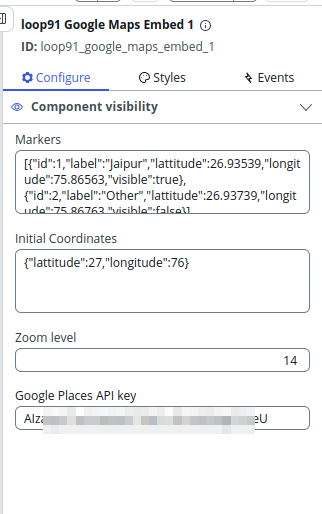

## How to use this component
1. Open UI Builder 
2. Click `Add Content` to open the component picker

    
3. Configure your component

    


### Technical details of configurations

#### Markers properties
```
schema : {
        "type":"array",
        "items": {
            "type":"object",
            "properties": {
                "id":{
                    "type":"number"
                },
                "lattitude":{
                    "type":"number"
                },
                "longitude":{
                    "type":"number"
                },
                "label":{
                    "type":"string"
                },
                "visible":{
                    "type":"boolean"
                }
            }
        }

        }

example : [
    {
        "id": 1,
        "label": "Jaipur",
        "lattitude": 26.93539,
        "longitude": 75.86563,
        "visible": true
    },
    {
        "id": 2,
        "label": "Other",
        "lattitude": 26.93739,
        "longitude": 75.86763,
        "visible": false
    }
]
```

Initial Coordinates
```
schema : {
        "type":"object",
        "properties":{
            "lattitude":{
                "type":"number"
            },
            "longitude":{
                "type":"number"
            }
        }
    }
example : {
    "lattitude": 27,
    "longitude": 76
}
```
