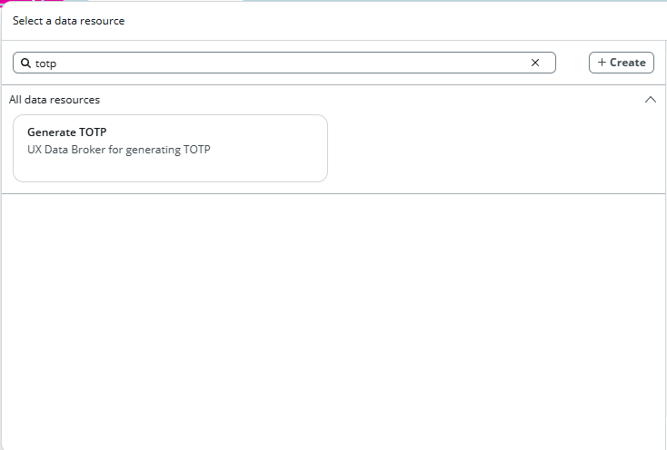
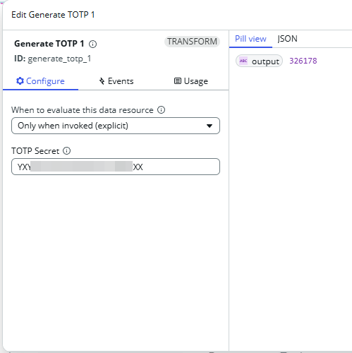
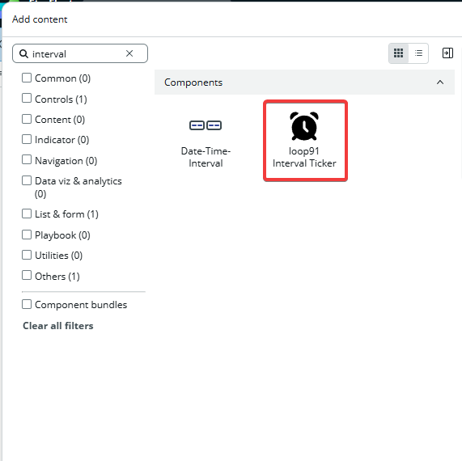
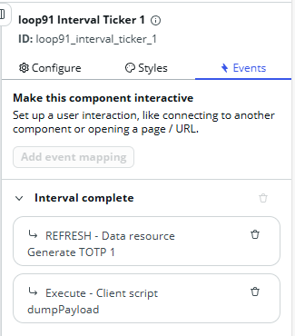

## The component is made to work by two parts
1. Data Resource - `Generate TOTP`
2. UI Builder Component `loop91 Interval Ticker`

## How to use this component
1. Add Data Resouce to the page
   
2. Configure Data Resource
   

Open UI Builder 
1. Click `Add Content` to open the component picker
   
2. Configure your component - The event trigger every 30 seconds

    
