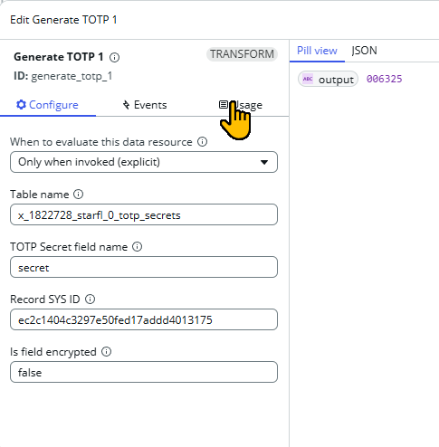

## The component is made to work by two parts
1. Data Resource - `Generate TOTP`
2. UI Builder Component `loop91 Interval Ticker`

## How to use this component
1. Add Data Resouce to the page

   
2. Configure Data Resource
   
   

**Important Note regarding Encrypted Fields (PW2):** If you are retrieving a secret stored within an encrypted field, you must establish a Cross-Scope Access Policy to successfully invoke the .getDecryptedValue() method. 

Configure the policy as follows:

  - Source Scope: x_904640_loop91_ui
  - Target Scope: The scope of your target table

Open UI Builder 
1. Click `Add Content` to open the component picker
   
   
2. Configure your component - The event trigger every 30 seconds
   
   
